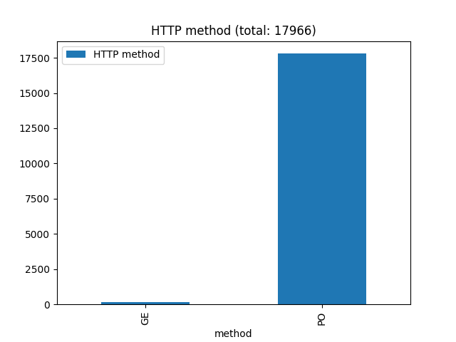
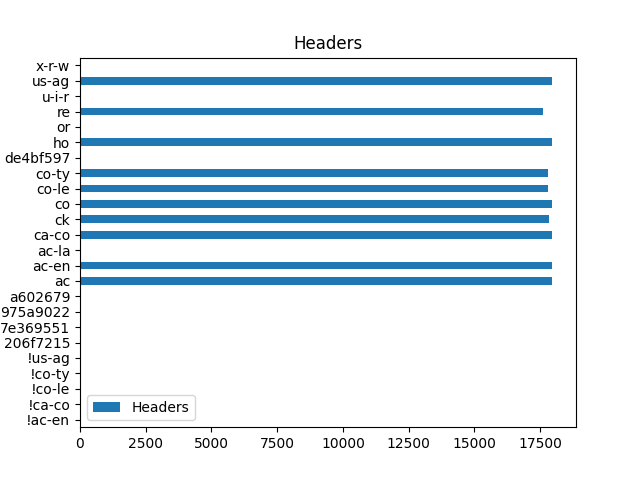
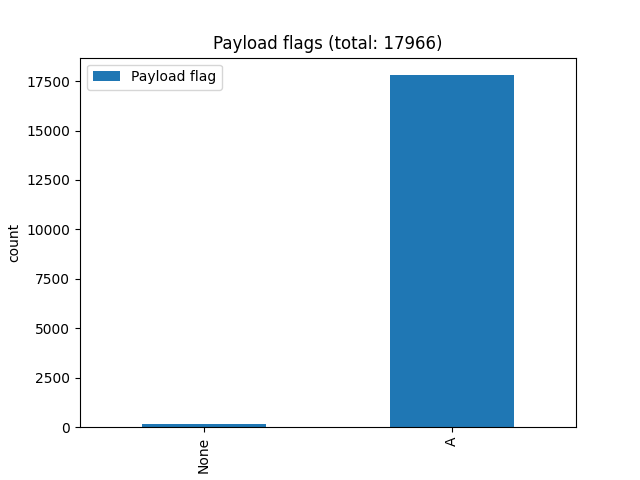
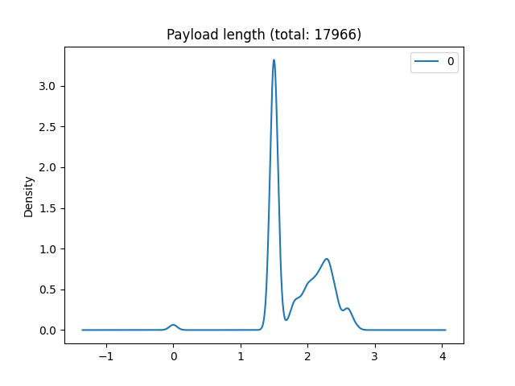
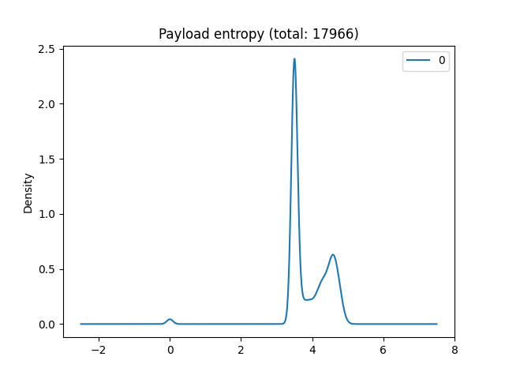

# fingerlib

[](https://github.com/Xisabla/fingerlib/actions/workflows/build-test-library.yaml)

HTTP Fingerprint generation and distance computation library in C++

## Requirements

- [`faup`](https://github.com/stricaud/faup)
- [`libboost`](https://www.boost.org/) >= **1.71**
- [`clang-format`](https://clang.llvm.org/docs/ClangFormat.html) & [`clang-tidy`](https://clang.llvm.org/extra/clang-tidy/) for code formatting
- [`cpputest`](https://cpputest.github.io/) as test framework >= **3.8**

## Getting started

### Building the library

```bash
make
```

The library should be located in `out/` as `out/fingerlib.so`

### Using the library

```cpp
#include "include/finger/fingerprint.hpp"

int main() {
    // Computes and print the fingerprint
    std::cout << fingerprint({ ... }) << std::endl;
}
```

## Dataset

### Run server

We use [OWASP webgoat](https://owasp.org/www-project-webgoat/) as test server to feed our dataset.

The custom docker image also runs `tshark` in background to capture requests

First build the docker image:

```bash
cd server
docker build . -t fingerlib/server
```

Then run it:

```bash
docker run -it -p 8080:8080 -v "$(pwd)/out:/out" fingerlib/server
```

OWASP Goat server will be running on http://127.0.0.1:8080/WebGoat/, pcap files will be available under `out` directory.

If you need more specifics captures, feel fire to run `docker exec` to enter the running container, write your output files to `/out` to get them the mounted volume, such as:

```bash
docker exec -u root -it <container name> bash
$ chown -R root:root /out  # fix possible right issues
$ tshark -w /out/pcap-oneshot.pcap -i eth0
```

### Compute fingerprints

**Once the capture is finished (container must be stopped)**, you can use the script `script/convert.py` to compute the fingerprints from your pcap.

```bash
./script/convert.py ./server/out/capture.pcap -o out.json
```

It will keep trace of the request and parsed data from the pcap file for each entry.

This data will be used to forge datasets or as fingerlib test data (using `--cpp` and/or `--filter` flags)

Example output:

```json
[
  {
    "pcap": {
      /* ... */
    },
    "request": {
      "raw": "POST /WebGoat/SqlInjection/attack2 HTTP/1.1\r\nHost: localhost:8080\r\nConnection: keep-alive\r\nContent-Length: 27\r\nAccept: */*\r\nX-Requested-With: XMLHttpRequest\r\nUser-Agent: Mozilla/5.0 (Windows NT 10.0; Win64; x64) AppleWebKit/537.36 (KHTML, like Gecko) Chrome/101.0.4951.67 Safari/537.36\r\nContent-Type: application/x-www-form-urlencoded; charset=UTF-8\r\nSec-GPC: 1\r\nOrigin: http://localhost:8080\r\nSec-Fetch-Site: same-origin\r\nSec-Fetch-Mode: cors\r\nSec-Fetch-Dest: empty\r\nReferer: http://localhost:8080/WebGoat/start.mvc\r\nAccept-Encoding: gzip, deflate, br\r\nAccept-Language: en-US,en;q=0.9,fr;q=0.8,fr-FR;q=0.7\r\nCookie: JSESSIONID=ShNWQhpygudrm4YZIyeuyEVx-KfWIA69eQh3MTCH; io=X7bDFISesUttMUz-AAAB; WEBWOLFSESSION=divcuQWCtGCAGeyR1GT3_H7_kVDeeQ--IVOvV6UY\r\n\r\n",
      "parsed": [
        "POST /WebGoat/SqlInjection/attack2 HTTP/1.1",
        "Host: localhost:8080",
        "Connection: keep-alive",
        "Content-Length: 27",
        "Accept: */*",
        "X-Requested-With: XMLHttpRequest",
        "User-Agent: Mozilla/5.0 (Windows NT 10.0; Win64; x64) AppleWebKit/537.36 (KHTML, like Gecko) Chrome/101.0.4951.67 Safari/537.36",
        "Content-Type: application/x-www-form-urlencoded; charset=UTF-8",
        "Sec-GPC: 1",
        "Origin: http://localhost:8080",
        "Sec-Fetch-Site: same-origin",
        "Sec-Fetch-Mode: cors",
        "Sec-Fetch-Dest: empty",
        "Referer: http://localhost:8080/WebGoat/start.mvc",
        "Accept-Encoding: gzip, deflate, br",
        "Accept-Language: en-US,en;q=0.9,fr;q=0.8,fr-FR;q=0.7",
        "Cookie: JSESSIONID=ShNWQhpygudrm4YZIyeuyEVx-KfWIA69eQh3MTCH; io=X7bDFISesUttMUz-AAAB; WEBWOLFSESSION=divcuQWCtGCAGeyR1GT3_H7_kVDeeQ--IVOvV6UY"
      ],
      "payload": "query=SELECT+*+FROM+example"
    },
    "fingerprint": {
      "epoch_time": "1652880878.628930183",
      "ip_src": "172.17.0.1",
      "ip_dst": "172.17.0.2",
      "port_src": "60158",
      "port_dst": "8080",
      "fingerprint": "1.5|3|0.9|||||PO|1|ho,co,co-le,ac,x-r-w,us-ag,co-ty,1586472b,or,7e369551,a602679,975a9022,re,ac-en,ac-la,ck|co:ke-al/ac:as-as/us-ag:92028000/co-ty:16fc986f/ac-en:gz,de,br/ac-la:b88ab870|A|4.3|1.4"
    },
    "tags": ["sql", "auto"]
  }
]
```

### Plot relevant data

The `script/plot.py` script contain useful methods to show relevant data from freshly converted dataset.

We use those figures to find out representative values in a malicious fingerprint that could be exploited to easily distinguish malicious fingerprint from benign.

Feel free to edit the plot script to adapt visualizations for your datasets.

Example results for the dataset `datasets/sqli_sqlmap_20220524.json`:






